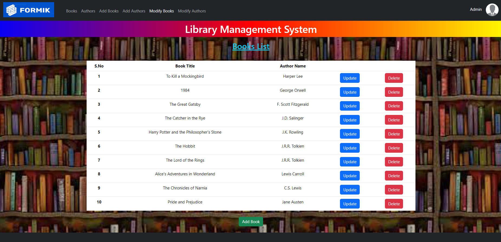

# React Formik Library Management System.

This project is a React application that serves as an admin dashboard for a library management system. It allows users to manage book and author details, featuring Formik for form validations.

1. User interface of the application showcases its layout and design elements.
   


---

2. Edit interface enables editing and modifying books and authors.
   


---

## Features

- **Manage Books**: Add, edit, and delete book records with fields for title, author, ISBN number, and publication date.
- **Manage Authors**: Add, edit, and delete author records with fields for name, birth date, and biography.
- **Form Validations**: All forms in the dashboard are validated using Formik to ensure data integrity.
- **Responsive Design**: Clean and responsive UI for easy navigation and use.

## Technologies Used

- **React**: JavaScript library for building user interfaces.
- **Formik**: Form library for React applications, used for form validations.
- **CSS**: Styling the application for responsive design.

## Installation

1. **Clone the Repository**
   ```bash
   git clone https://github.com/Rajkumar-195/React-Formik-Library-Management-System

2. **Navigate to the project directory:**
   ```bash
   cd React-Formik-Library-Management-System

3. **cd react-shopping-cart:**
   ```bash
   npm install

4. **Start the development server:**
   ```bash
   npm run dev
---

## Development Process

- **Initial Setup**: Created React app and installed necessary dependencies.
- **Implement Book Management**:
  - Designed UI and functionality for adding, editing, and deleting book records.
  - Integrated Formik for form validations.
- **Implement Author Management**:
  - Developed UI and functionality for adding, editing, and deleting author records.
  - Implemented Formik validations for author-related forms.
- **Responsive Design**: Ensured the dashboard UI is responsive across different devices.
- **Testing and Debugging**: Conducted testing to verify form validations and overall functionality.

## Conclusion

This React application demonstrates effective use of Formik for validating forms within an admin dashboard for library management. It provides a user-friendly interface for managing book and author details efficiently.

## Contact

For any inquiries or feedback, please contact:
- Name: Rajkumar A
- Email: rajkumaranbu195@gmail.com
- LinkedIn: [Rajkumar A](https://www.linkedin.com/in/rajkumar-info/)
